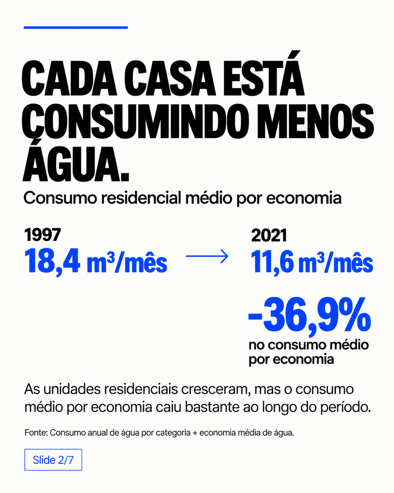
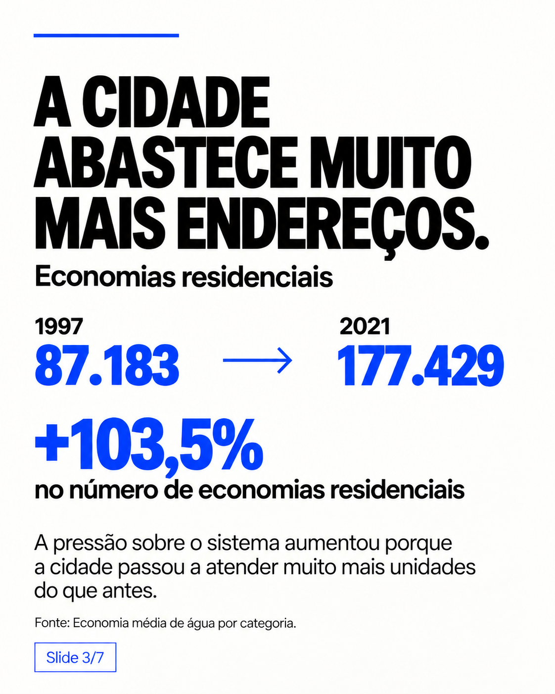
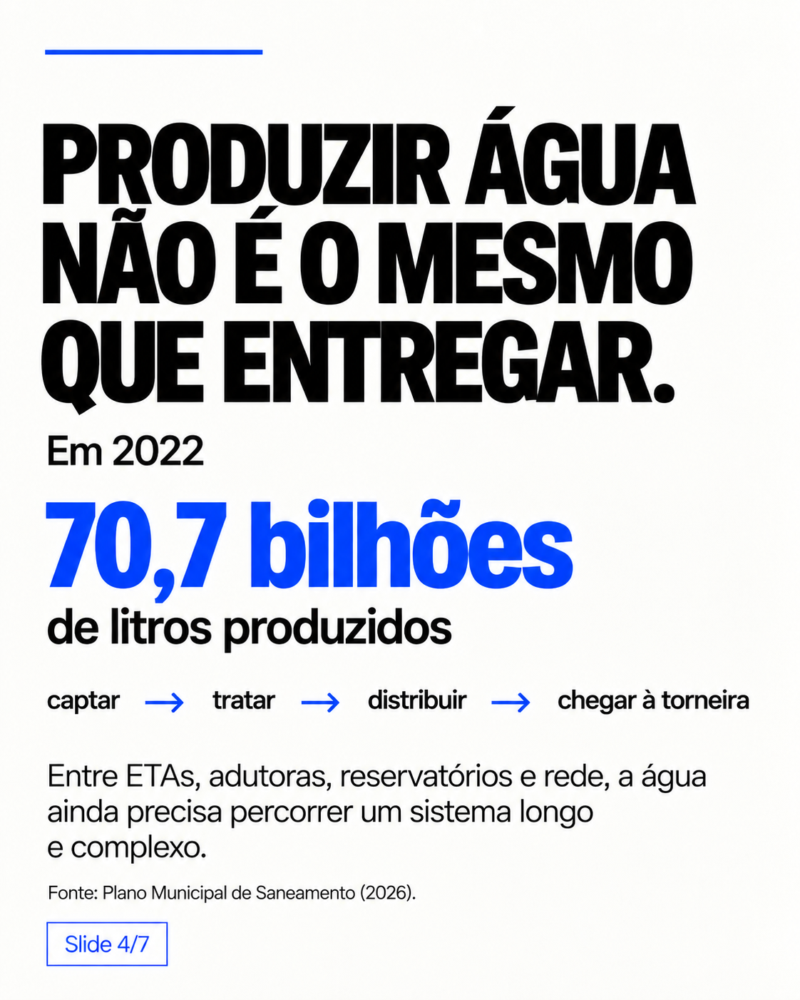
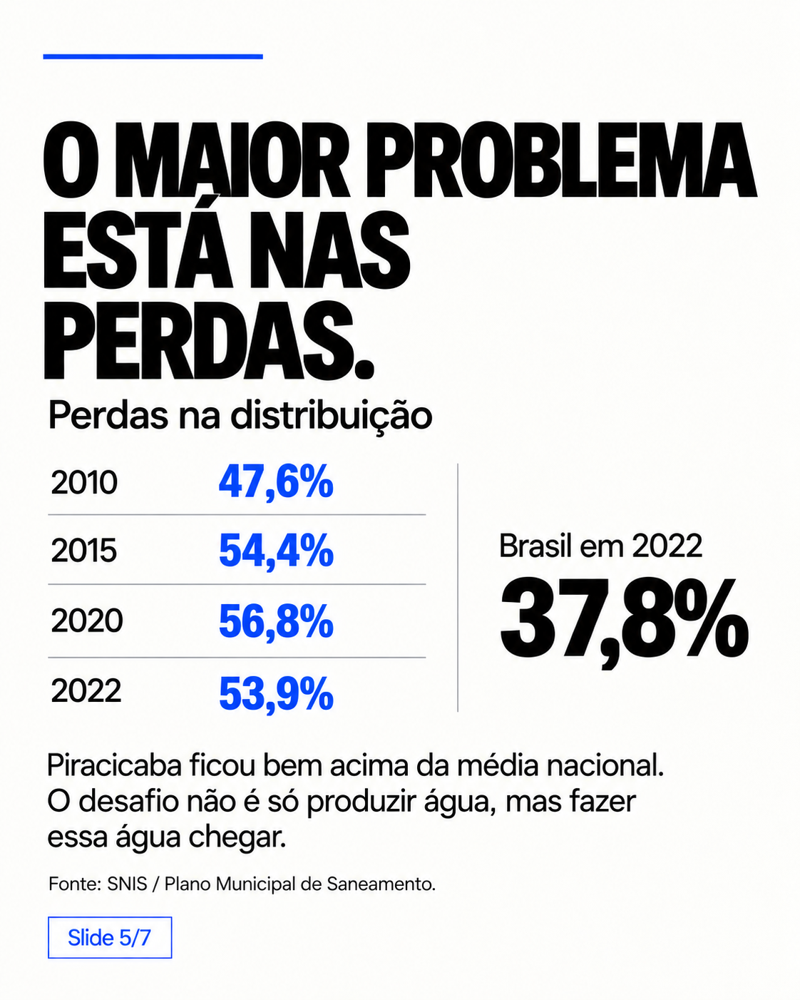
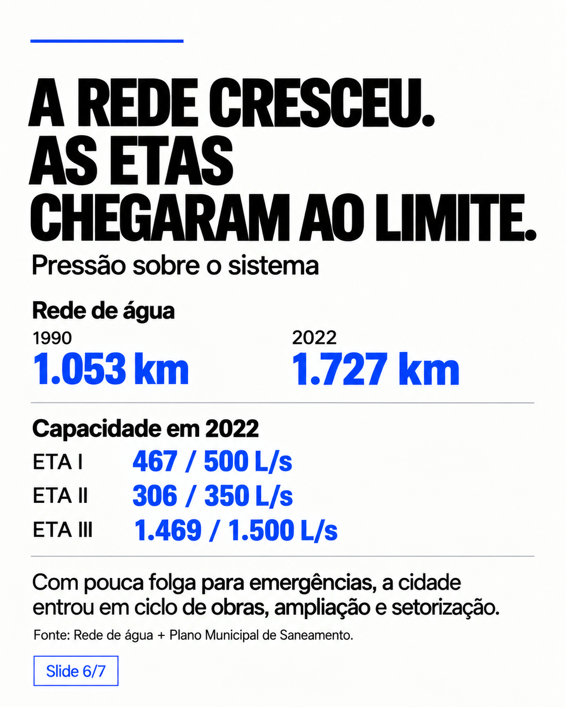
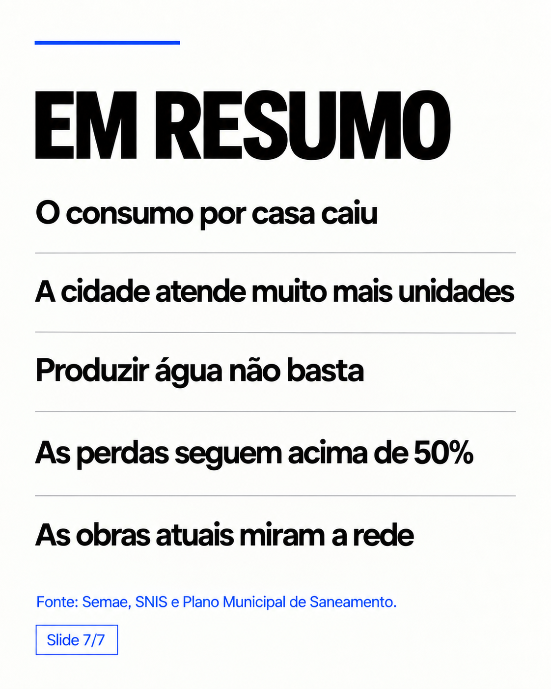

# Quanta água Piracicaba bebe?

Projeto de **análise de dados e data storytelling** da série *Piracicaba Data Stories*, investigando consumo, produção, distribuição, perdas e infraestrutura do sistema de abastecimento de água do município.

A pergunta que iniciou o projeto foi simples:

> **Piracicaba está consumindo água demais?**

Os dados mostram uma história mais complexa. O consumo médio por economia residencial caiu, o número de unidades atendidas cresceu fortemente e os indicadores oficiais mostram perdas elevadas na distribuição. Ao mesmo tempo, o Plano Municipal de Saneamento registra ETAs operando próximas de suas capacidades.


## Principais achados

- O consumo residencial médio caiu de aproximadamente **18,4 m³ por economia/mês em 1997 para 11,6 m³ em 2021**: **-36,9%**.
- O número de economias residenciais passou de **87.183 para 177.429** no mesmo período: **+103,5%**.
- O PMSB registra **70.719.256 m³ de água produzidos em 2022**, cerca de **70,7 bilhões de litros**.
- O índice de perdas na distribuição foi de **53,93% em 2022**, segundo a série SNIS reproduzida no PMSB.
- O próprio PMSB cita a média nacional de **37,78% em 2022**.
- Em 2022, a ETA I operava em média a **467,2 L/s** frente a capacidade de 500 L/s; a ETA II a **306,1/350 L/s**; e a ETA III a **1.468,7/1.500 L/s**.
- A rede de água passou de **1.053 km em 1990** para aproximadamente **1.727 km em 2022**.

## Carrossel

### 1. Quanta água Piracicaba bebe?


### 2. Cada economia residencial consome menos água


### 3. A cidade atende muito mais unidades


### 4. Produzir água não é o mesmo que entregar


### 5. O maior problema está nas perdas


### 6. A rede cresceu e as ETAs operavam próximas do limite


### 7. Em resumo


## Bases convertidas para CSV

Os PDFs enviados foram transformados em arquivos tabulares limpos dentro de `data/clean/`.

| Arquivo | Período | Conteúdo |
|---|---|---|
| `consumo_agua_por_categoria_1990_2022.csv` | 1990-2022 | volume consumido por categoria |
| `economias_agua_por_categoria_1997_2022.csv` | 1997-2022 | economias/unidades consumidoras por categoria |
| `populacao_faixa_etaria_1980_2050.csv` | 1980-2050 | estimativa populacional por faixa etária |
| `populacao_faixa_etaria_long_1980_2050.csv` | 1980-2050 | mesma base em formato longo |
| `extensao_rede_agua_esgoto_1976_2022.csv` | 1976-2022 | expansão e extensão existente das redes |
| `ligacoes_agua_esgoto_por_categoria_2000_2022.csv` | 2000-2022 | ligações médias mensais por categoria |
| `precipitacao_mensal_1917_2022.csv` | 1917-2022 | precipitação mensal |
| `precipitacao_anual_1917_2022.csv` | 1917-2022 | médias e totais anuais de chuva |
| `producao_distribuicao_agua_1989_2022.csv` | 1989-2022 | produção e distribuição anual |
| `vazao_rio_piracicaba_1989_2019.csv` | 1989-2019 | vazões média, mínima e máxima |
| `pmsb_*.csv` | 2010-2023 | tabelas selecionadas do PMSB 2026 |

## Dados processados

`data/processed/` contém tabelas calculadas a partir das bases limpas:

- `consumo_residencial_por_economia_1997_2021.csv`;
- `chuva_vazao_1989_2019.csv`;
- `serie_sistema_agua_1990_2021.csv`;
- `carousel_metrics.csv`.

## Metodologia

### Consumo residencial por economia

O indicador do slide 2 é calculado por:

```text
consumo residencial anual (m³)
---------------------------------
 economias residenciais × 12
```

Em 1997:

```text
19.268.164 / 87.183 / 12 = 18,4 m³/mês
```

Em 2021:

```text
24.730.998 / 177.429 / 12 = 11,6 m³/mês
```

A variação é de aproximadamente **-36,9%**.

> **Economia** é o termo técnico usado pelo Semae para uma unidade consumidora atendida. Não significa “economizar água”. O carrossel usa “casa” em alguns trechos como simplificação editorial, mas o indicador correto é por **economia residencial**.

### Perdas

A série de perdas de 2010 a 2022 foi transcrita da **Tabela 25 do PMSB 2026**, elaborada com dados da série histórica do SNIS.

O projeto não calcula perda de distribuição usando simplesmente `produzido - consumido`, porque o indicador regulatório envolve conceitos e volumes específicos do sistema. Por isso, os percentuais publicados usam diretamente SNIS/SINISA reproduzidos no Plano.

### Clima e vazão

As bases de precipitação (ESALQ/USP) e vazão do Rio Piracicaba (Semae) foram mantidas separadas e também combinadas em uma tabela processada apenas para facilitar análises temporais. Nenhuma correlação é tratada como causalidade.

## Cuidados com os dados

Há inconsistências e períodos parciais nos documentos originais. Eles foram **preservados e sinalizados**, não corrigidos silenciosamente.

- Nos PDFs históricos, **2022 contém apenas janeiro** em diversas tabelas.
- A vazão do rio em **2019 cobre janeiro a outubro**.
- A tabela histórica de produção/distribuição tem valores que merecem cautela, especialmente **2010** e **2019**; `quality_flag` registra as inconsistências detectadas.
- A estimativa populacional SEADE antiga não deve ser misturada automaticamente com o Censo 2022. O PMSB usa **423.323 habitantes no Censo 2022**.
- O próprio PMSB contém **dois valores diferentes para perdas em 2023**: 55,40% em um trecho e 54,50% em outro. Ambos foram preservados em `pmsb_perdas_2023_valores_conflitantes.csv`.
- Em algumas linhas da base populacional, a soma das faixas etárias não coincide com o total publicado. O CSV inclui `diferenca_total_menos_soma` e `quality_flag`.

## Estrutura

```text
assets/
  carousel/

data/
  clean/
  processed/

docs/
  carousel-story.md
  data-dictionary.md
  methodology.md
  sources.md
  validation.md

src/
  build_metrics.py
  validate_data.py

README.md
```

## Reprodução dos indicadores

Os CSVs limpos são a camada de entrada do projeto. Para recalcular as principais métricas:

```bash
python src/build_metrics.py
python src/validate_data.py
```

Os scripts usam apenas a biblioteca padrão do Python.

## Fontes

- Serviço Municipal de Água e Esgoto - **SEMAE Piracicaba**;
- **Piracicaba em Dados / IPPLAP**;
- Escola Superior de Agricultura Luiz de Queiroz - **ESALQ/USP**;
- Fundação **SEADE**;
- **SNIS / SINISA**;
- **Revisão do Plano Municipal de Saneamento Básico de Piracicaba - Capítulo 4: Abastecimento de Água (fevereiro/2026)**.

Detalhes em [`docs/sources.md`](docs/sources.md).

## Autor

**Gabriel Delvaje**  
*Piracicaba Data Stories*
